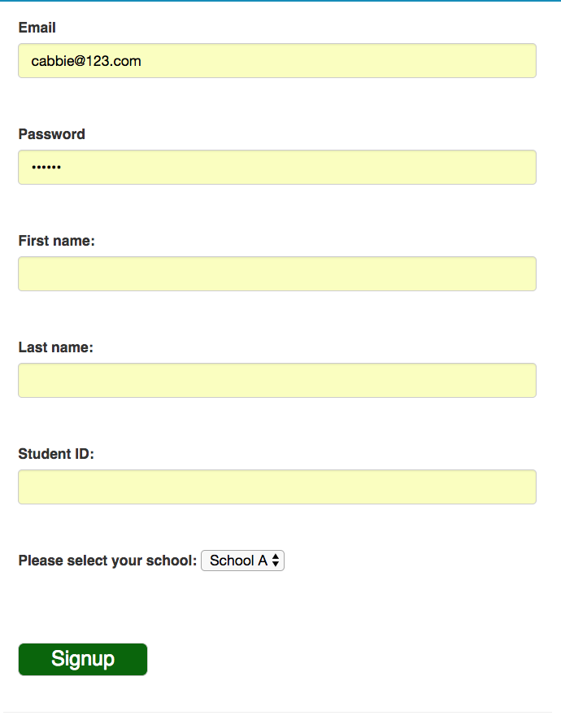
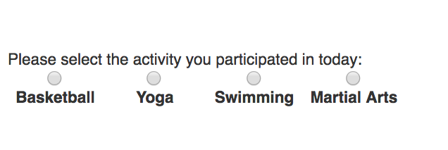
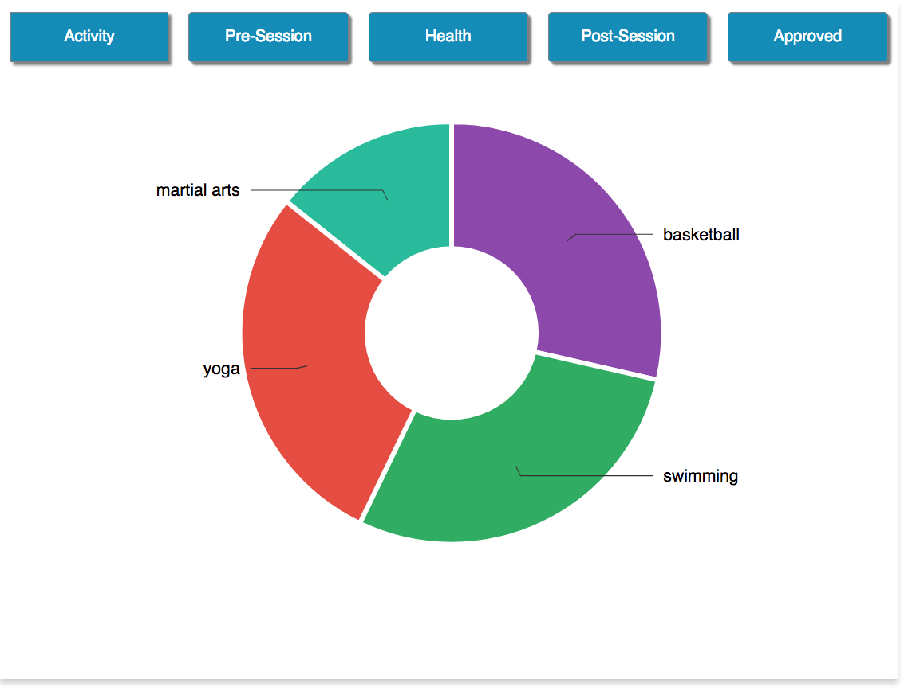
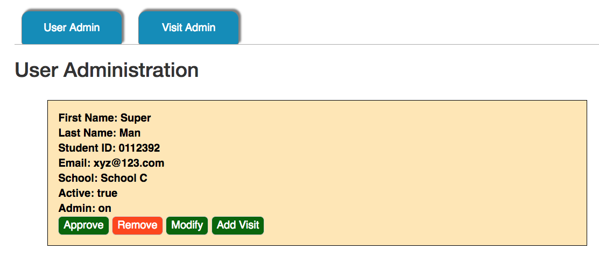
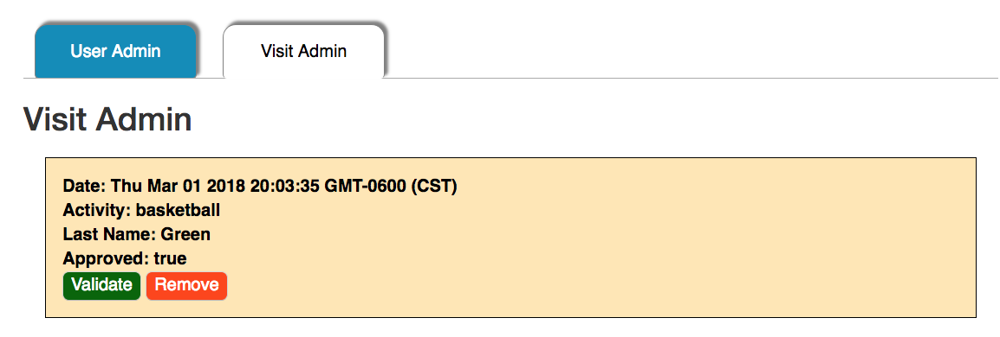
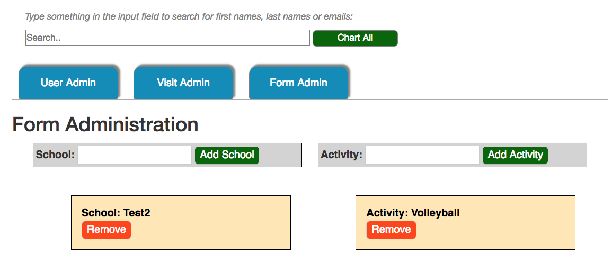

# Passport-To-Lifetime-Fitness
This was originally forked from Easy Node Authentication. Those templates were used for the authentication mechanism.

## Instructions and Usage
This app was designed for a program being piloted for a large urban school system. It is a partnership with organizations, such as the Boys and Girls Club, to encourage fitness in students. Students that are part of the pilot program participate in one of 4 activities. The app tracks their participation so the teachers can make better decisions.
There are a couple things to note:
The index page contains some "holding text" that the organization will alter when they decide what they want there. They may also include links to various schools and non-profit websites. The design was done to facilitate this. The same applies to the help email in the footer. The organizations will adjust it as needed for their purposes.

## Link to the heroku deployment
https://passport-fitness.herokuapp.com/
For this deployment, here are some users to test:
admin1@admin.com/admin1 - an admin user who can modify users, visits and forms, approve visits, approve new users, and grant users admin privileges.
admin2@admin.com/admin2 - an admin user who can modify users, visits and forms, approve visits, approve new users, and grant users admin privileges.

student1@student.com/student1, student2@student.com/student2, student3@student.com/student3 - students who can view their own histories and enter visits for approval.

student4@student.com/student4 - a new user not yet approved. They will only see a pending approval message on login. An admin can approve this user at which point they can start adding visits. They will not see a chart for visit history unless some visits are entered.
## Student use examples
### Students can Register:

### Add Visits:

### See their history:

## App Admin examples
### Application Admins can modify users and see the history of any user:

### Approve or modify visits:

### Add and remove schools and activities (this will render in the affected forms)

# Passport-To-Lifetime-Fitness
